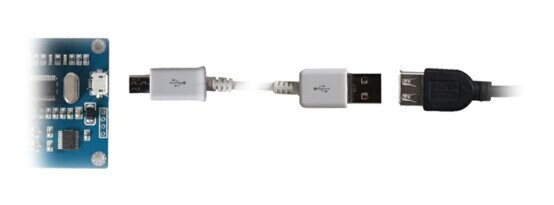

# HW-034(ICSE012A) 4-channel 5V Relay Module Board Relay Control Board with Indicator USB Input

Modul ini memiliki port Micro USB dan port serial, sehingga dapat berkomunikasi dengan PC maupun perangkat lain dengan mudah. Tegangan kerja normal untuk modul ini adalah 5V, dan khusus untuk tipe ICSE014A terdapat antarmuka daya eksternal 5V.
 Spesifikasinya sebagai berikut:

Semua modul dilengkapi dengan Micro USB dan port serial. Penjelasan pin adalah sebagai berikut:

1. Micro USB : Konektor standar tipe Micro USB.
2. TX : Pin transmisi data (Transmit).
3. RX : Pin penerima data (Receive).
4. 5V : Catu daya 5 Volt.
5. GND : Ground.
6. Power Interface : Hanya tersedia pada tipe ICSE014A. Antarmuka ini digunakan jika suplai daya dari Micro USB tidak mencukupi.

| Parameter           | ICSE012A | ICSE013A | ICSE014A | Unit  | Keterangan                            |
| ------------------- | -------- | -------- | -------- | ----- | ------------------------------------- |
| **CC**              | 4        | 2        | 8        | –     | Jumlah channel pada modul             |
| **I**               | 400      | 250      | 700      | mA    | Arus kerja                            |
| **U**               | 5        | 5        | 5        | V     | Tegangan input                        |
| **Serial Port**     | ✓        | ✓        | ✓        | –     | Ketersediaan port serial              |
| **Baud Rate**       | 9600     | 9600     | 9600     | bit/s | Kecepatan komunikasi serial           |
| **F**               | 1000     | 1000     | 1000     | Hz    | Frekuensi kontrol modul               |
| **Power Interface** | ✗        | ✗        | ✓        | –     | Ketersediaan antarmuka daya eksternal |

------

## **Cara Penggunaan**

Modul dapat berkomunikasi langsung dengan perangkat lain melalui port serial. Modul akan menerima satu byte data dari perangkat pengendali dengan baud rate 9600.

| Perangkat Pengendali | Kode yang Dikirim | Kode Balasan Modul |
| -------------------- | ----------------- | ------------------ |
| Upper Monitor        | 0x50, 0x51        |                    |
| ICSE012A             |                   | 0xAB               |
| ICSE013A             |                   | 0xAD               |
| ICSE014A             |                   | 0xAC               |

Setelah modul menerima data “0x51”, modul akan beralih ke mode kerja normal.
 Pada mode ini, setiap byte data berikutnya akan langsung mengontrol status relay.
 Setiap bit di dalam byte tersebut mewakili satu channel relay:

- Bit = 0 → Relay ON (aktif)
- Bit = 1 → Relay OFF (nonaktif)

| Bit  | ICSE012A | ICSE013A | ICSE014A | Keterangan              |
| ---- | -------- | -------- | -------- | ----------------------- |
| 0    | ✓        | ✓        | ✓        | Mengontrol relay **K1** |
| 1    | ✓        | ✓        | ✓        | Mengontrol relay **K2** |
| 2    | ✓        | ✗        | ✓        | Mengontrol relay **K3** |
| 3    | ✓        | ✓        | ✓        | Mengontrol relay **K4** |
| 4    | ✗        | ✗        | ✓        | Mengontrol relay **K5** |
| 5    | ✗        | ✗        | ✓        | Mengontrol relay **K6** |
| 6    | ✗        | ✗        | ✓        | Mengontrol relay **K7** |
| 7    | ✗        | ✗        | ✓        | Mengontrol relay **K8** |

### Cara koneksi

## Link Source-code

https://github.com/nemanjadjekic/ICSE012A_4_ChannelRelayBoard_PythonScript

## Fix USB driver

- https://www.youtube.com/watch?v=q7MQvInR8ts

